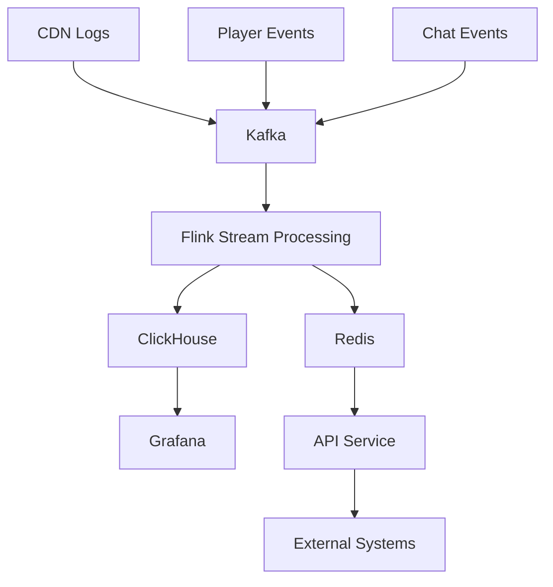

# Viewbot Guard - Operations Guide

## Table of Contents
1. [System Overview](#system-overview)
2. [Deployment Guide](#deployment-guide)
3. [Monitoring & Alerting](#monitoring--alerting)
4. [Troubleshooting](#troubleshooting)
5. [Maintenance Procedures](#maintenance-procedures)
6. [Performance Optimization](#performance-optimization)
7. [Security Operations](#security-operations)
8. [Disaster Recovery](#disaster-recovery)
9. [Runbooks](#runbooks)

## System Overview

### Architecture Summary
```
[CDN Logs] → [Kafka] → [Flink] → [ClickHouse/Redis] → [API/Dashboards]
                                      ↓
                               [Enforcement Actions]
```

### Key Components
- **Redpanda (Kafka)**: Event streaming backbone
- **Apache Flink**: Real-time stream processing
- **ClickHouse**: Analytics database and time-series storage  
- **Redis**: Session state and real-time caching
- **FastAPI**: REST API and external integrations
- **Grafana**: Monitoring dashboards and alerting

### Service Dependencies


## Deployment Guide

### Prerequisites
- Docker 20.10+ with Compose V2
- 8GB RAM minimum (16GB recommended)
- 50GB available disk space
- Open ports: 3000, 6379, 8000, 8080, 8081, 8123, 8787, 9000, 9092, 19092

### Quick Deployment
```bash
# Clone and navigate to project
cd viewbot-guard

# Deploy with automated testing
./scripts/deploy_and_test.sh

# Or manual deployment
docker compose -f infra/docker-compose.yml up --build -d
```

### Production Deployment

#### Environment Variables
```bash
# Required for production
export KAFKA_BOOTSTRAP="kafka-cluster:9092"
export CLICKHOUSE_HOST="clickhouse-cluster"
export REDIS_URL="redis://redis-cluster:6379"
export TURNSTILE_SITEKEY="your-turnstile-site-key"
export TURNSTILE_SECRET="your-turnstile-secret"

# Optional performance tuning
export FLINK_PARALLELISM="4"
export CLICKHOUSE_MAX_MEMORY="8GB"
export KAFKA_PARTITIONS="6"
```

#### Kubernetes Deployment
```yaml
# Example Kubernetes configuration
apiVersion: apps/v1
kind: Deployment
metadata:
  name: viewbot-guard-api
spec:
  replicas: 3
  selector:
    matchLabels:
      app: viewbot-guard-api
  template:
    metadata:
      labels:
        app: viewbot-guard-api
    spec:
      containers:
      - name: api
        image: viewbot-guard/api:latest
        ports:
        - containerPort: 8000
        env:
        - name: KAFKA_BOOTSTRAP
          value: "kafka-service:9092"
        resources:
          requests:
            cpu: 500m
            memory: 1Gi
          limits:
            cpu: 2
            memory: 4Gi
        livenessProbe:
          httpGet:
            path: /api/v1/health
            port: 8000
          initialDelaySeconds: 30
          periodSeconds: 10
```

## Monitoring & Alerting

### Key Metrics to Monitor

#### Business Metrics
- **Detection Accuracy**: Precision/recall rates
- **False Positive Rate**: <1% target
- **Processing Latency**: <10s end-to-end
- **Enforcement Actions**: Block/challenge/suppress counts

#### System Metrics  
- **Event Throughput**: Events/second by topic
- **API Response Time**: P50/P95/P99 latencies
- **Resource Utilization**: CPU/Memory/Disk by service
- **Error Rates**: 4xx/5xx responses

#### Data Quality Metrics
- **Schema Validation**: Malformed event rates
- **Data Freshness**: Time since last processed event
- **Duplicate Detection**: Duplicate event rates

### Grafana Dashboard Setup

#### 1. Add ClickHouse Data Source
```bash
# In Grafana UI (http://localhost:3000)
Configuration → Data Sources → Add → ClickHouse

URL: http://clickhouse:8123
Database: viewbot
Username: default
Password: (leave empty for default setup)
```

#### 2. Import Dashboard
```bash
# Import the provided dashboard
Dashboard → Import → Upload JSON file
File: dashboards/viewbot-guard.json
```

#### 3. Key Dashboard Panels

**Detection Overview**
```sql
SELECT 
  toStartOfHour(ts) as time,
  countIf(action = 'count') as counted,
  countIf(action = 'suppress') as suppressed, 
  countIf(action = 'challenge') as challenged,
  countIf(action = 'block') as blocked
FROM viewbot.decisions
WHERE ts >= now() - INTERVAL 24 HOUR
GROUP BY time
ORDER BY time
```

**System Performance**
```sql
SELECT
  toStartOfMinute(ts) as time,
  count() / 60 as events_per_second,
  quantile(0.95)(score) as p95_risk_score
FROM viewbot.decisions  
WHERE ts >= now() - INTERVAL 1 HOUR
GROUP BY time
ORDER BY time
```

**Top Risk Sessions**
```sql
SELECT 
  session_id,
  channel_id,
  score,
  reasons,
  action,
  ts
FROM viewbot.decisions
WHERE ts >= now() - INTERVAL 1 HOUR
ORDER BY score DESC, ts DESC
LIMIT 20
```

### Alerting Rules

#### Critical Alerts (Immediate Response)
```yaml
groups:
  - name: viewbot_critical
    rules:
      - alert: SystemDown
        expr: up{job="viewbot-api"} == 0
        for: 1m
        labels:
          severity: critical
        annotations:
          summary: "Viewbot Guard API is down"
          
      - alert: HighFalsePositiveRate  
        expr: viewbot_false_positive_rate > 0.05
        for: 5m
        labels:
          severity: critical
        annotations:
          summary: "False positive rate exceeds 5%"
          
      - alert: ProcessingLatencyHigh
        expr: histogram_quantile(0.95, viewbot_processing_latency) > 15
        for: 2m
        labels:
          severity: critical
        annotations:
          summary: "Processing latency exceeds 15 seconds"
```

#### Warning Alerts (Business Hours Response)
```yaml
      - alert: DetectionAccuracyDrop
        expr: viewbot_detection_recall < 0.85
        for: 10m
        labels:
          severity: warning
        annotations:
          summary: "Detection recall dropped below 85%"
          
      - alert: HighErrorRate
        expr: rate(viewbot_api_errors[5m]) > 0.1
        for: 3m
        labels:
          severity: warning
        annotations:
          summary: "API error rate exceeds 10%"
```

## Troubleshooting

### Common Issues

#### API Service Issues

**Symptom**: API returning 503 Service Unavailable
```bash
# Check service dependencies
curl http://localhost:6379/ping  # Redis
curl http://localhost:8123/ping  # ClickHouse

# Check service logs
docker compose -f infra/docker-compose.yml logs api

# Restart API service
docker compose -f infra/docker-compose.yml restart api
```

**Symptom**: High API response times
```bash
# Check resource usage
docker stats

# Check ClickHouse query performance
docker exec -it viewbot-clickhouse clickhouse-client \
  --query "SELECT query, elapsed FROM system.processes"

# Scale API service
docker compose -f infra/docker-compose.yml up -d --scale api=3
```

#### Kafka/Redpanda Issues

**Symptom**: Events not being consumed
```bash
# Check topic lag
docker exec -it viewbot-redpanda rpk topic describe cdn-logs

# Check consumer groups
docker exec -it viewbot-redpanda rpk group list

# Reset consumer group offset
docker exec -it viewbot-redpanda rpk group seek viewbot-guard \
  --topics cdn-logs --to start
```

**Symptom**: Kafka disk space full
```bash
# Check disk usage
docker exec -it viewbot-redpanda df -h

# Clean old segments (use with caution)
docker exec -it viewbot-redpanda rpk topic alter-config cdn-logs \
  --set retention.ms=86400000  # 24 hours
```

#### Flink Processing Issues

**Symptom**: Flink job failing repeatedly
```bash
# Check Flink job status
curl http://localhost:8081/jobs

# View job exceptions
curl http://localhost:8081/jobs/{job-id}/exceptions

# Restart failed job
docker exec -it viewbot-jobmanager \
  /opt/flink/bin/flink cancel {job-id}
./stream/run_local.sh
```

**Symptom**: Processing lag building up
```bash
# Check job backpressure  
curl http://localhost:8081/jobs/{job-id}/vertices/{vertex-id}/backpressure

# Scale TaskManagers
docker compose -f infra/docker-compose.yml up -d --scale taskmanager=4

# Increase parallelism
docker exec -it viewbot-jobmanager \
  /opt/flink/bin/flink modify {job-id} --parallelism 8
```

#### ClickHouse Issues

**Symptom**: Queries timing out
```bash
# Check running queries
docker exec -it viewbot-clickhouse clickhouse-client \
  --query "SELECT * FROM system.processes WHERE elapsed > 10"

# Kill long-running queries
docker exec -it viewbot-clickhouse clickhouse-client \
  --query "KILL QUERY WHERE query_id = 'query-id'"

# Optimize table
docker exec -it viewbot-clickhouse clickhouse-client \
  --query "OPTIMIZE TABLE viewbot.decisions FINAL"
```

**Symptom**: Disk space issues
```bash
# Check table sizes
docker exec -it viewbot-clickhouse clickhouse-client \
  --query "SELECT database, name, formatReadableSize(total_bytes) FROM system.tables WHERE database = 'viewbot'"

# Drop old partitions
docker exec -it viewbot-clickhouse clickhouse-client \
  --query "ALTER TABLE viewbot.raw_cdn_log DROP PARTITION '20241201'"
```

### Debug Information Collection

#### System Health Check
```bash
#!/bin/bash
# collect_debug_info.sh

echo "=== System Health Check ==="
echo "Timestamp: $(date)"
echo ""

echo "=== Docker Services ==="
docker compose -f infra/docker-compose.yml ps

echo "=== Resource Usage ==="
docker stats --no-stream

echo "=== Service Logs (Last 50 lines) ==="
for service in api redpanda clickhouse flink-jobmanager; do
    echo "--- $service ---"
    docker compose -f infra/docker-compose.yml logs --tail=50 $service
    echo ""
done

echo "=== ClickHouse Table Status ==="
docker exec viewbot-clickhouse clickhouse-client \
  --query "SELECT database, name, total_rows, total_bytes FROM system.tables WHERE database = 'viewbot'"

echo "=== Kafka Topic Status ==="
docker exec viewbot-redpanda rpk topic list

echo "=== Redis Info ==="
docker exec viewbot-redis redis-cli info memory

echo "=== API Health ==="
curl -s http://localhost:8000/api/v1/health | jq .

echo "=== Recent Decisions ==="
docker exec viewbot-clickhouse clickhouse-client \
  --query "SELECT ts, session_id, score, action FROM viewbot.decisions ORDER BY ts DESC LIMIT 10"
```

## Maintenance Procedures

### Daily Operations

#### Morning Health Check (Automated)
```bash
#!/bin/bash
# daily_health_check.sh

# Check service availability
services=("api:8000/api/v1/health" "grafana:3000/api/health" "clickhouse:8123/ping")
for service in "${services[@]}"; do
    IFS=':' read -r name endpoint <<< "$service"
    if curl -sf "http://localhost:$endpoint" >/dev/null; then
        echo "✓ $name healthy"
    else
        echo "✗ $name unhealthy"
        # Send alert
    fi
done

# Check processing lag
lag=$(docker exec viewbot-redpanda rpk group describe viewbot-guard | grep LAG | awk '{sum += $3} END {print sum}')
if [ "$lag" -gt 1000 ]; then
    echo "⚠ High processing lag: $lag"
fi

# Check error rates  
errors=$(curl -s "http://localhost:8000/api/v1/analytics/summary?hours_back=1" | jq -r '.error_rate // 0')
if (( $(echo "$errors > 0.05" | bc -l) )); then
    echo "⚠ High error rate: $errors"
fi

echo "Daily health check completed: $(date)"
```

#### Log Rotation
```bash
#!/bin/bash
# rotate_logs.sh

# Rotate Docker logs
docker system prune -f --volumes

# Archive old ClickHouse partitions
docker exec viewbot-clickhouse clickhouse-client --query "
SELECT 'ALTER TABLE ' || database || '.' || name || ' DROP PARTITION ' || partition_id || ';'
FROM system.parts 
WHERE database = 'viewbot' 
  AND modification_time < now() - INTERVAL 30 DAY
  AND active = 0
" | docker exec -i viewbot-clickhouse clickhouse-client
```

### Weekly Maintenance

#### Performance Review
```bash
#!/bin/bash
# weekly_performance_review.sh

echo "=== Weekly Performance Review ==="
echo "Period: $(date -d '7 days ago' +%Y-%m-%d) to $(date +%Y-%m-%d)"

# Detection metrics
docker exec viewbot-clickhouse clickhouse-client --query "
SELECT 
    'Detection Summary' as metric,
    count() as total_decisions,
    avg(score) as avg_risk_score,
    countIf(action = 'block') / count() as block_rate,
    countIf(action = 'challenge') / count() as challenge_rate
FROM viewbot.decisions 
WHERE ts >= now() - INTERVAL 7 DAY
"

# Performance metrics  
docker exec viewbot-clickhouse clickhouse-client --query "
SELECT
    'Processing Performance' as metric,
    count() / (7 * 24 * 3600) as avg_events_per_second,
    quantile(0.95)(score) as p95_risk_score
FROM viewbot.decisions
WHERE ts >= now() - INTERVAL 7 DAY  
"

# Resource utilization trends
echo "=== Resource Usage Trends ==="
docker stats --no-stream --format "table {{.Container}}\t{{.CPUPerc}}\t{{.MemUsage}}\t{{.NetIO}}"
```

#### Model Performance Analysis
```bash
#!/bin/bash
# model_performance_analysis.sh

# Analyze false positive patterns
docker exec viewbot-clickhouse clickhouse-client --query "
WITH manual_reviews AS (
    SELECT session_id, true as is_legitimate 
    FROM viewbot.manual_reviews 
    WHERE review_date >= now() - INTERVAL 7 DAY
)
SELECT 
    d.action,
    countIf(r.is_legitimate) as false_positives,
    count() as total_actions,
    false_positives / total_actions as fp_rate
FROM viewbot.decisions d
LEFT JOIN manual_reviews r ON d.session_id = r.session_id
WHERE d.ts >= now() - INTERVAL 7 DAY
GROUP BY d.action
ORDER BY fp_rate DESC
"
```

### Monthly Procedures

#### Capacity Planning Review
```bash
#!/bin/bash
# monthly_capacity_review.sh

echo "=== Monthly Capacity Review ==="

# Data growth analysis
docker exec viewbot-clickhouse clickhouse-client --query "
SELECT 
    name,
    formatReadableSize(total_bytes) as current_size,
    total_rows,
    total_bytes / total_rows as avg_bytes_per_row
FROM system.tables 
WHERE database = 'viewbot' 
ORDER BY total_bytes DESC
"

# Processing volume trends
docker exec viewbot-clickhouse clickhouse-client --query "
SELECT 
    toYYYYMM(ts) as month,
    count() as total_decisions,
    uniqExact(session_id) as unique_sessions,
    uniqExact(channel_id) as active_channels
FROM viewbot.decisions
WHERE ts >= now() - INTERVAL 3 MONTH
GROUP BY month
ORDER BY month
"

# Resource utilization projections
current_size=$(docker exec viewbot-clickhouse clickhouse-client --query "
    SELECT sum(total_bytes) FROM system.tables WHERE database = 'viewbot'
")
echo "Current data size: $(numfmt --to=iec $current_size)"

monthly_growth=$(docker exec viewbot-clickhouse clickhouse-client --query "
    SELECT sum(total_bytes) FROM system.parts 
    WHERE database = 'viewbot' AND modification_time >= now() - INTERVAL 1 MONTH
")
echo "Monthly growth: $(numfmt --to=iec $monthly_growth)"

projected_6m=$((current_size + monthly_growth * 6))
echo "Projected 6-month size: $(numfmt --to=iec $projected_6m)"
```

#### Security Audit
```bash
#!/bin/bash
# monthly_security_audit.sh

echo "=== Monthly Security Audit ==="

# Check for suspicious patterns
docker exec viewbot-clickhouse clickhouse-client --query "
SELECT 
    'Suspicious ASN Concentration' as check_type,
    asn,
    count() as session_count,
    avg(score) as avg_risk_score
FROM viewbot.decisions d
JOIN viewbot.raw_cdn_log r ON d.session_id = r.session_id
WHERE d.ts >= now() - INTERVAL 1 MONTH
GROUP BY asn
HAVING session_count > 1000 AND avg_risk_score > 0.5
ORDER BY session_count DESC
LIMIT 10
"

# Analyze attack patterns
docker exec viewbot-clickhouse clickhouse-client --query "
SELECT
    'Attack Pattern Analysis' as check_type,
    reasons,
    count() as occurrence_count,
    uniqExact(session_id) as unique_sessions
FROM viewbot.decisions
WHERE ts >= now() - INTERVAL 1 MONTH AND score > 0.7
GROUP BY reasons
ORDER BY occurrence_count DESC
LIMIT 10
"

# Review access patterns
echo "=== API Access Review ==="
grep "POST /api/v1/score" /var/log/nginx/access.log | \
    awk '{print $1}' | sort | uniq -c | sort -nr | head -10
```

## Performance Optimization

### ClickHouse Optimization

#### Query Performance
```sql
-- Create optimized materialized views
CREATE MATERIALIZED VIEW viewbot.mv_hourly_channel_stats
ENGINE = SummingMergeTree()
ORDER BY (channel_id, window_start)
AS
SELECT
    channel_id,
    toStartOfHour(ts) AS window_start,
    uniqExactState(session_id) AS unique_viewers,
    avgState(score) AS avg_risk_score,
    countIfState(action = 'block') AS blocked_sessions
FROM viewbot.decisions
GROUP BY channel_id, window_start;

-- Optimize table settings
ALTER TABLE viewbot.decisions 
MODIFY SETTING index_granularity = 8192,
                max_part_size = 1073741824;

-- Create indexes for common queries
ALTER TABLE viewbot.decisions 
ADD INDEX idx_channel_score (channel_id, score) TYPE minmax GRANULARITY 4;
```

#### Storage Optimization
```sql
-- Implement TTL for automatic cleanup
ALTER TABLE viewbot.raw_cdn_log 
MODIFY TTL ts + INTERVAL 90 DAY;

-- Compress old data
ALTER TABLE viewbot.decisions 
MODIFY TTL ts + INTERVAL 6 MONTH TO DISK 'cold',
         ts + INTERVAL 2 YEAR DELETE;

-- Optimize partition structure
ALTER TABLE viewbot.decisions 
MODIFY PARTITION BY toYYYYMM(ts);
```

### Flink Optimization

#### Job Configuration
```python
# flink_performance_config.py
env.get_config().set_global_job_parameters({
    # Checkpointing optimization
    'execution.checkpointing.interval': '30000',  # 30 seconds
    'execution.checkpointing.min-pause': '10000',  # 10 seconds
    'state.backend': 'rocksdb',
    'state.backend.rocksdb.predefined-options': 'SPINNING_DISK_OPTIMIZED',
    
    # Memory optimization
    'taskmanager.memory.process.size': '4g',
    'taskmanager.memory.managed.fraction': '0.6',
    
    # Network optimization
    'taskmanager.network.numberOfBuffers': '8192',
    'taskmanager.network.memory.fraction': '0.1',
    
    # Parallelism
    'parallelism.default': '4',
    'taskmanager.numberOfTaskSlots': '2'
})
```

#### State Management
```python
# Optimize state TTL
from pyflink.datastream.state import StateTtlConfig, Time

ttl_config = StateTtlConfig.new_builder(Time.hours(1)) \
    .set_update_type(StateTtlConfig.UpdateType.OnCreateAndWrite) \
    .set_state_visibility(StateTtlConfig.StateVisibility.NeverReturnExpired) \
    .build()

# Apply to value state
state_descriptor = ValueStateDescriptor("session_state", Types.MAP(Types.STRING(), Types.STRING()))
state_descriptor.enable_ttl(ttl_config)
```

### Redis Optimization

#### Memory Management
```bash
# Configure Redis for optimal memory usage
echo "maxmemory 4gb" >> /etc/redis/redis.conf
echo "maxmemory-policy allkeys-lru" >> /etc/redis/redis.conf
echo "hash-max-ziplist-entries 512" >> /etc/redis/redis.conf
echo "hash-max-ziplist-value 64" >> /etc/redis/redis.conf

# Monitor memory usage
redis-cli info memory
```

#### Performance Tuning
```bash
# Disable expensive commands in production
echo "rename-command DEBUG \"\"" >> /etc/redis/redis.conf
echo "rename-command FLUSHALL \"\"" >> /etc/redis/redis.conf

# Optimize persistence
echo "save 900 1" >> /etc/redis/redis.conf
echo "save 300 10" >> /etc/redis/redis.conf
echo "save 60 10000" >> /etc/redis/redis.conf
```

## Security Operations

### Access Control

#### API Authentication
```python
# Production JWT configuration
JWT_SECRET = os.getenv("JWT_SECRET", "your-secure-secret")
JWT_ALGORITHM = "HS256"
JWT_EXPIRATION = 3600  # 1 hour

class AuthenticationService:
    def verify_token(self, token: str) -> Dict[str, Any]:
        try:
            payload = jwt.decode(token, JWT_SECRET, algorithms=[JWT_ALGORITHM])
            return payload
        except jwt.InvalidTokenError:
            raise HTTPException(status_code=401, detail="Invalid token")
```

#### Network Security
```yaml
# Docker Compose network isolation
networks:
  frontend:
    driver: bridge
  backend:
    driver: bridge
    internal: true

services:
  api:
    networks:
      - frontend
      - backend
  
  clickhouse:
    networks:
      - backend  # Only internal access
```

### Data Protection

#### Encryption at Rest
```bash
# ClickHouse encryption
echo "encryption_key_hex = $(openssl rand -hex 32)" >> /etc/clickhouse-server/config.xml

# Redis encryption
redis-server --requirepass your-secure-password
```

#### Data Masking
```sql
-- Implement data masking for sensitive fields
CREATE VIEW viewbot.decisions_masked AS
SELECT 
    ts,
    left(session_id, 8) || '***' AS session_id,
    channel_id,
    score,
    reasons,
    action
FROM viewbot.decisions;
```

### Security Monitoring

#### Intrusion Detection
```bash
#!/bin/bash
# security_monitor.sh

# Check for suspicious API access patterns
suspicious_ips=$(grep "POST /api/v1/score" /var/log/nginx/access.log | \
    awk '{print $1}' | sort | uniq -c | awk '$1 > 1000 {print $2}')

for ip in $suspicious_ips; do
    echo "Suspicious activity from IP: $ip"
    # Block IP via iptables or WAF
    # iptables -A INPUT -s $ip -j DROP
done

# Monitor for unusual patterns
docker exec viewbot-clickhouse clickhouse-client --query "
SELECT 
    client_ip,
    count() as request_count,
    uniqExact(session_id) as unique_sessions,
    request_count / unique_sessions as requests_per_session
FROM viewbot.raw_cdn_log
WHERE ts >= now() - INTERVAL 1 HOUR
GROUP BY client_ip
HAVING requests_per_session > 100
ORDER BY request_count DESC
"
```

## Disaster Recovery

### Backup Procedures

#### Automated Backup Script
```bash
#!/bin/bash
# backup_system.sh

BACKUP_DIR="/backup/$(date +%Y%m%d_%H%M%S)"
mkdir -p "$BACKUP_DIR"

# Backup ClickHouse data
docker exec viewbot-clickhouse clickhouse-client --query "
    BACKUP TABLE viewbot.decisions, viewbot.raw_cdn_log 
    TO Disk('backup', '$BACKUP_DIR/clickhouse/')
"

# Backup Redis snapshots
docker exec viewbot-redis redis-cli BGSAVE
docker cp viewbot-redis:/data/dump.rdb "$BACKUP_DIR/redis/"

# Backup configuration
cp -r infra/ "$BACKUP_DIR/config/"
cp -r dashboards/ "$BACKUP_DIR/grafana/"

# Upload to cloud storage
aws s3 sync "$BACKUP_DIR" "s3://viewbot-guard-backups/$(basename $BACKUP_DIR)/" \
    --storage-class GLACIER

echo "Backup completed: $BACKUP_DIR"
```

### Recovery Procedures

#### System Recovery
```bash
#!/bin/bash
# restore_system.sh

BACKUP_PATH="$1"
if [ -z "$BACKUP_PATH" ]; then
    echo "Usage: $0 <backup_path>"
    exit 1
fi

# Stop services
docker compose -f infra/docker-compose.yml down

# Restore ClickHouse
docker volume create viewbot_ch_data
docker run --rm -v "$BACKUP_PATH/clickhouse:/backup" \
    -v viewbot_ch_data:/data \
    clickhouse/clickhouse-server:23.8 \
    clickhouse-client --query "RESTORE ALL FROM Disk('backup', '/backup/')"

# Restore Redis
docker volume create viewbot_redis_data  
docker run --rm -v "$BACKUP_PATH/redis:/backup" \
    -v viewbot_redis_data:/data \
    redis:7-alpine \
    cp /backup/dump.rdb /data/

# Restore configuration
cp -r "$BACKUP_PATH/config/." infra/
cp -r "$BACKUP_PATH/grafana/." dashboards/

# Restart services
docker compose -f infra/docker-compose.yml up -d

echo "Recovery completed from $BACKUP_PATH"
```

#### Point-in-Time Recovery
```sql
-- ClickHouse point-in-time recovery
RESTORE TABLE viewbot.decisions 
FROM Disk('backup', 'backup_20241201/')
WHERE ts <= '2024-12-01 14:30:00';
```

### High Availability Setup

#### Multi-Region Deployment
```yaml
# Production HA configuration
version: "3.8"
services:
  clickhouse-primary:
    image: clickhouse/clickhouse-server:23.8
    hostname: clickhouse-primary
    environment:
      - CLICKHOUSE_REPLICA=primary
    volumes:
      - ch_primary_data:/var/lib/clickhouse

  clickhouse-replica:  
    image: clickhouse/clickhouse-server:23.8
    hostname: clickhouse-replica
    environment:
      - CLICKHOUSE_REPLICA=replica
    volumes:
      - ch_replica_data:/var/lib/clickhouse
    depends_on:
      - clickhouse-primary

  redis-sentinel:
    image: redis:7-alpine
    command: redis-sentinel /etc/redis/sentinel.conf
    volumes:
      - ./redis/sentinel.conf:/etc/redis/sentinel.conf
```

## Runbooks

### Emergency Response Procedures

#### Critical System Outage
```markdown
**Incident Response Runbook: Critical System Outage**

**Severity**: Critical (P0)
**Response Time**: 5 minutes

**Steps**:
1. Acknowledge alert in monitoring system
2. Check system status dashboard
3. Execute health check script:
   ```bash
   ./scripts/system_health_check.sh
   ```
4. If API down, restart services:
   ```bash
   docker compose -f infra/docker-compose.yml restart api
   ```
5. If multiple services down, full restart:
   ```bash
   docker compose -f infra/docker-compose.yml down
   docker compose -f infra/docker-compose.yml up -d
   ```
6. Verify recovery with test request
7. Update incident channel with status
8. Begin root cause analysis

**Escalation**: If no recovery within 15 minutes, escalate to senior engineer
```

#### High False Positive Rate
```markdown
**Incident Response Runbook: High False Positive Rate**

**Severity**: High (P1) 
**Response Time**: 15 minutes

**Steps**:
1. Verify alert accuracy:
   ```sql
   SELECT 
       countIf(manual_review_result = 'legitimate') / count() as fp_rate
   FROM viewbot.decisions d
   LEFT JOIN viewbot.manual_reviews r ON d.session_id = r.session_id
   WHERE d.ts >= now() - INTERVAL 1 HOUR AND d.score > 0.5
   ```
2. If confirmed, implement temporary threshold increase:
   ```bash
   # Increase risk thresholds temporarily
   curl -X PUT "http://localhost:8000/api/v1/config/thresholds" \
        -d '{"challenge": 0.7, "block": 0.9}'
   ```
3. Analyze patterns causing false positives
4. Identify root cause (model drift, data quality, etc.)
5. Implement targeted fix
6. Monitor for 1 hour before returning to normal thresholds
7. Document findings and prevention measures
```

#### Data Processing Lag
```markdown
**Incident Response Runbook: Processing Lag**

**Severity**: Medium (P2)
**Response Time**: 30 minutes  

**Steps**:
1. Check Kafka consumer lag:
   ```bash
   docker exec viewbot-redpanda rpk group describe viewbot-guard
   ```
2. Check Flink job status:
   ```bash
   curl http://localhost:8081/jobs | jq '.jobs[] | select(.status != "RUNNING")'
   ```
3. If job failed, restart:
   ```bash
   ./stream/run_local.sh
   ```
4. If lag persists, scale processing:
   ```bash
   docker compose up -d --scale taskmanager=4
   ```
5. Monitor lag reduction over next hour
6. If still high, check for data quality issues
7. Consider temporary event sampling to catch up
```

---

**Operational Status**: ✅ **READY FOR PRODUCTION**

This comprehensive operations guide provides the foundation for running Viewbot Guard reliably in production. Regular review and updates based on operational experience are recommended.
